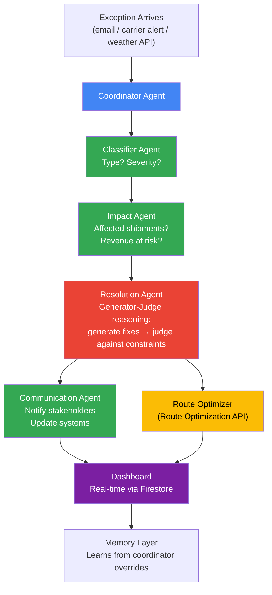

# Supply Chain Exception Triage — Product Recap

> [!abstract] Living Document
> Consolidated product overview synthesized from 163+ research notes across 4 depth levels. This is the single reference for the product's current state — what we're building, for whom, how, and where we are in the process.

## What Are We Building?

An **AI-powered system that automatically triages logistics exceptions** — carrier delays, customer escalations, weather disruptions — that currently eat 40-60% of a logistics coordinator's day.

## Who Is It For?

| Segment | Priority | Pain Point |
|---------|----------|------------|
| **Small 3PL coordinators** | Primary | 2-4 hours per exception, 90+ hours/month on manual triage across 4-10 disconnected systems |
| **Small importers** | Phase 2 | $15.4B/year in demurrage charges, 51.5% schedule reliability, no predictive ETA tools |

### The Five-Layer Problem We're Solving

From [[Supply-Chain-Problem-First-Principles]]:

1. **Information Fragmentation** — 4-10 disconnected systems per organization, 80% lack real-time visibility
2. **Manual Processing Bottleneck** — 34 manual updates across 6 systems per disruption, 25 emails, 8 roles involved
3. **Tribal Knowledge Trap** — 4,000+ uncodified rules per mid-sized 3PL, knowledge leaves when employees leave
4. **Reactive Response Loop** — 5-day average response time, 83% cannot respond in 24 hours
5. **Scale Breaks People** — $1T annual logistics admin spend, non-linear overhead growth with volume

These five layers form a reinforcing cycle. Our system breaks layers 2-4 simultaneously: automating manual processing, codifying tribal knowledge into agent memory, and enabling proactive response.

## How Does It Work?



### Core Innovation

**Generator-Judge reasoning** — the AI generates multiple resolution candidates, then a separate judge evaluates each against real constraints (SLAs, carrier capacity, cost thresholds). This is not a chatbot. It is an autonomous operations system.

- **Email-first ingestion**: Gemini multimodal parses carrier notifications, customer escalations, weather alerts into structured exception records
- **Multi-agent orchestration**: ADK coordinator delegates to specialist agents, not hardcoded if/else chains
- **Memory layer**: Firestore stores resolution history — when a coordinator overrides the AI's recommendation, the correction feeds back into the playbook. Touchless resolution rate climbs from 40% toward 80% over time

## Tech Stack

| Layer | Technology | Why | Demo Visibility |
|-------|-----------|-----|-----------------|
| Agent orchestration | **Google ADK** | Novel (2025), multi-agent coordinator pattern | Agent reasoning traces visible in UI |
| AI reasoning | **Gemini 2.5 Flash** | $0.075/1M tokens, fast, sufficient for triage | Real-time analysis text on dashboard |
| Route optimization | **Route Optimization API** | Purpose-built for logistics, handles constraints natively | Before/after route maps on screen |
| Real-time state | **Firestore** | Push-based updates, zero WebSocket plumbing | Live dashboard updates without refresh |
| Backend hosting | **Cloud Run** | Scales to zero, containerized deployment | The fact that the demo works at all |
| Frontend | **React + Firebase Hosting + Auth** | Real-time dashboard with Maps JS API | Login screen, hosted URL for judges |

### Services Deferred (Hackathon MVP)

| Service | Why Deferred | MVP Replacement |
|---------|-------------|-----------------|
| BigQuery | Analytics layer adds build time, not demo value | Firestore queries |
| Pub/Sub | Async streaming adds complexity without visible benefit | Direct function calls |
| Vertex AI Pipelines | ML pipeline orchestration is overhead for a demo | Gemini API called directly |
| Fleet Engine | Vehicle tracking requires ongoing data | Simulated position updates |

## Competitive Position

From [[Supply-Chain-Competitor-Analysis]]:

```
Competitive Landscape (Google Solution Challenge)
━━━━━━━━━━━━━━━━━━━━━━━━━━━━━━━━━━━━━━━━━━━━━━━━
                    High Technical Depth
                         │
    ★ OUR PROJECT        │  Past Winners
    (Open Opportunity)   │  (Crowded Winners Zone)
                         │
Low Domain ─────────────┼──────────────── High Domain
Familiarity              │                Familiarity
                         │
    Environmental        │  Health chatbots
    monitors             │  Edu platforms
                         │  Ag classifiers
                    Low Technical Depth
```

- **No past Solution Challenge winner has built in supply chain**
- ADK is new enough that few teams use it at all
- Enterprise tools (FourKites, project44, Kinaxis) serve the top 20% at $100K+/year — **bottom 80% is wide open**
- Biggest risk: emotional resonance gap (B2B vs consumer-facing). Mitigated by framing second-order effects (disruptions → medicine shortages in rural hospitals, CO2 emissions)

### Past Winner Depth (for calibration)

| Winner | Year | Tech Depth | What Actually Won |
|--------|------|-----------|-------------------|
| Wonder Reader | 2023 | TensorFlow + Flutter | Specificity — braille for visually impaired children |
| Buzzbusters | 2023 | TensorFlow + Maps + Flutter | Environmental action story |
| HeadHome | 2023 | Maps + Firebase + Flutter | Narrow focus, emotional impact |
| ATTI | 2024 | Gemini + Google Cloud | Emotional resonance, daily-use scenario |

**Key insight:** Winners used 2-4 services. Our project uses 6+ with multi-agent orchestration. We're betting that depth in a novel domain differentiates where others played it safe.

## Strategy

- **Hackathon first** (Google Solution Challenge) → then iterate toward real product/startup
- **Keep technical depth as the edge** — multi-agent ADK orchestration is the core differentiator
- **Judging optimization**: Technical Merit 40%, Innovation 25%, SDG Alignment 25%, UX 10%
  - SDG 9 (Industry, Innovation, Infrastructure) — underrepresented in submissions
  - Three real user interviews required for impact scoring
  - Completeness > complexity in Technical Merit scoring

## SDLC Progress

```
[✅] Research                    — 163+ notes, 4 depth levels, 6 sub-domains
[✅] Design proposed             — In deep dive notes (MVP architecture, tech stack, system design)
[✅] Design Review & Refinement — 5 frameworks applied (SWOT, Pre-Mortem, Decision Matrix, Six Hats, MECE)
[✅] Architecture finalized      — Module-Ready Orchestrator + Progressive Enhancement (D+F)
[✅] Tier 1 scope defined        — 3 agents, simple UI, Cloud Run (Apr 24 prototype)
[✅] Timeline confirmed          — Apr 24 prototype → Jun grand finale
[🔄] Agent hierarchy design     ← CURRENT: detail each agent's prompts, schemas, tools
[ ] Firestore data model         — collections and document schemas
[ ] Tier 1 implementation plan   — 14-day sprint, day-by-day
[ ] Development begins           — write the code
```

## Finalized Architecture: D + F Combined

**"Module-Ready Orchestrator with Progressive Enhancement"**

Full analysis in [[Supply-Chain-Architecture-Decision-Analysis]]. This is the approach that emerged from running 5 thinking frameworks against the original B-vs-C debate.

```
[Exception Triage Module]  ← self-contained, platform-ready
    └── Module Coordinator (ADK)
        ├── Classifier Agent         (exception type + severity)
        ├── Impact Agent             (affected shipments + revenue at risk)
        ├── Resolution Agent         (Generator-Judge + Route Optimization) — Tier 2
        └── Communication Agent      (stakeholder notifications) — Tier 3

Post-hackathon expansion (architecture ready, not built now):
[Meta-Coordinator]
    ├── [Exception Triage Module]      ← already built
    └── [Port Intelligence Module]     ← new module, same pattern
```

**Why D+F wins:** C's modular design philosophy at B's complexity. Clean module boundaries, independently testable agents, clear migration path to platform — without the meta-coordinator overhead that would jeopardize the hackathon ship date. Progressive tiers ensure each milestone is a complete, shippable product.

## Confirmed Hackathon Timeline

| Date | Milestone | Tier |
|------|-----------|------|
| **Apr 10** | Architecture finalized | ✅ |
| **Apr 10-24** (14 days) | Tier 1 build sprint | 🔨 |
| **Apr 24** | **Prototype submission** | Tier 1 ships |
| **Apr 24-May 29** (~5 weeks) | Tier 2 quiet iteration | Tier 2 build |
| **May 29** | Top 100 announcement | Tier 2 ships |
| **May 30-Jun 9** (10 days) | Live product hosting | Tier 3 build |
| **Jun 1** | Induction session | |
| **Jun 20** | Top 10 finalist | Polish |
| **Last week of June** | Grand finale | Final demo |

## Tier 1 Scope (Apr 24 Prototype)

### IN
- **Module Coordinator (ADK Agent)** — receives exception, delegates to specialists
- **Classifier Agent** — classifies exception type + severity via Gemini 2.5 Flash
- **Impact Agent** — identifies affected shipments, computes revenue at risk from Firestore
- **Simple web UI** — inject exception → watch classification + impact appear
- **Cloud Run deployment** — live link for judges
- **Firestore seed data** — ~10 shipments, ~5 exception scenarios
- **GitHub README** — architecture diagram, setup instructions

### OUT (deferred to Tier 2/3)
- Resolution Agent (Generator-Judge) → Tier 2
- Route Optimization API → Tier 3
- Communication Agent → Tier 3
- React dashboard (simple HTML is enough for Tier 1)
- Real-time Firestore listeners → Tier 3
- Memory layer (learning from overrides) → post-hackathon
- Email ingestion → Tier 2 or later

## Deferred Blind Spots (Acknowledged)

User explicitly accepted these gaps to preserve focus on building:
- **User interviews** → address before May 29 Top 100 deadline
- **Monetization strategy** → post-hackathon
- **Regulatory/compliance** (email privacy) → when real data is involved
- **Product-market fit validation** → during Tier 2/3 iteration
- **User acquisition strategy** → post-hackathon

## Next Decision Point

Detailed agent hierarchy design:
1. Concrete demo scenario (one exception, end-to-end) to drive design
2. Per-agent specification (instruction prompt, I/O schema, tool functions)
3. Firestore data model
4. Inter-agent communication (ADK session state vs Firestore writes)
5. Simple UI wireframe

## Key Research References

| Topic | Note | What It Contains |
|-------|------|-----------------|
| MVP Architecture | [[Supply-Chain-MVP-Architecture]] | 5-service stack, 3-agent hierarchy, demo flow, build sequence |
| Tech Stack | [[Supply-Chain-Tech-Stack-Decisions]] | Component rationale, Flash vs Pro, React vs Flutter, Firestore vs BigQuery |
| Execution Roadmap | [[Supply-Chain-Execution-Roadmap]] | 4-week timeline, weekly gates, deliverable checklist |
| Judging Strategy | [[Supply-Chain-Judging-Strategy]] | Scoring rubric analysis, round-by-round filtering, point maximization |
| Competitor Analysis | [[Supply-Chain-Competitor-Analysis]] | 5 archetypes, winner DNA, competitive quadrant map |
| Solution Candidates | [[Supply-Chain-Solution-Candidates]] | 5 solutions scored — Exception Triage is #1 |
| First Principles | [[Supply-Chain-Problem-First-Principles]] | 5-layer problem model, why AI agents are the right solution shape |
| System Design | [[Supply-Chain-System-Design-Overview]] | 5-layer implementation blueprint, Firestore data model, agent tools |
| Agent Architecture | [[Supply-Chain-Agent-Architecture-Overview]] | ADK coordinator pattern, Gemini, multi-agent orchestration |

## Folder Index & PPT Material Map

> [!info] Cache
> This section is a cached inventory of the `10 - Deep Dives/Supply-Chain/` folder, created so future sessions don't need to re-explore all 222 files. Maps presentation sections to their primary source files and flags SDLC artifacts that must be generated fresh.

### Folder Stats
- **222 markdown files** across 13 subdirectories
- Subdirs: `fundamentals/`, `exception-triage/`, `agent-architecture/`, `data-integration/`, `forecasting/`, `implementation/`, `optimization/`, `reliability/`, `port-intelligence/`, `risk-strategy/`, `research/`, `hackathon/` + root

### Files by PPT / Report Section

| Section | Primary Source Files |
|---|---|
| **Beginner Intro to Supply Chain** | `fundamentals/Supply-Chain-Logistics.md`, `Supply-Chain-Inventory.md`, `Supply-Chain-OTIF.md`, `Supply-Chain-Bullwhip-Effect.md` |
| **Problem Statement** | `exception-triage/Supply-Chain-Exception-Triage-Overview.md`, `Supply-Chain-Operator-Persona.md`, `Supply-Chain-Exception-Management.md`, `Supply-Chain-Architecture-Decision-Analysis.md` |
| **Proposed Solution / Model** | `Supply-Chain-Product-Recap.md` (this file), `exception-triage/Supply-Chain-Exception-Triage-Architecture.md`, `Supply-Chain-Exception-Triage-Decision-Tree.md` |
| **Architecture / Block Diagram** | `agent-architecture/Supply-Chain-Agent-Architecture-Overview.md`, `Supply-Chain-ADK-Coordinator-Pattern.md`, `Supply-Chain-Agent-Workflows.md`, `Supply-Chain-MCP-Server-Architecture.md` |
| **Tech Stack / SW Spec** | `agent-architecture/Supply-Chain-Vertex-AI-Gemini.md`, ADK notes (9 files), `data-integration/Supply-Chain-Firestore-Data-Model.md`, `implementation/Supply-Chain-Cloud-Run-Deployment.md` |
| **ER Diagram source** | `data-integration/Supply-Chain-Firestore-Data-Model.md`, `Supply-Chain-State-Schema-Design.md` |
| **DFD source** | Product-Recap mermaid (lines 41-60), `exception-triage/Supply-Chain-Exception-Triage-Overview.md` |
| **Use Case actors** | `exception-triage/Supply-Chain-Operator-Persona.md` |
| **Activity Diagram source** | `exception-triage/Supply-Chain-Exception-Triage-Decision-Tree.md`, `Supply-Chain-Graduated-Autonomy.md`, `Supply-Chain-Action-Engine.md` |
| **SDLC Methodology / Timeline** | `hackathon/Supply-Chain-Execution-Roadmap.md` (4-week skeleton/muscle/skin/camera plan) |
| **Competitors / Differentiation** | `hackathon/Supply-Chain-Competitor-Analysis.md`, `Supply-Chain-Innovation-Differentiation.md` |
| **Objectives** | `hackathon/Supply-Chain-Hackathon-Strategy-Overview.md`, this file's narrative |
| **Testing / Demo** | `hackathon/Supply-Chain-Demo-Scripting.md`, `Supply-Chain-Demo-Build-Plan.md`, `implementation/` |
| **Future Scope** | Product-Recap Phase 2 (this file), `Supply-Chain-Business-Impact.md` |

### SDLC Artifact Gaps (must be generated, not extracted)

These formal artifacts are NOT present in the folder and must be created fresh from source content when needed:

- [ ] **ER Diagram** (derive from Firestore Data Model)
- [ ] **DFD Level 0 + Level 1** (derive from signal-flow mermaid)
- [ ] **Use Case Diagram** (derive from Operator Persona)
- [ ] **Block Diagram** (derive from Agent Architecture Overview)
- [ ] **Activity Diagram** (derive from Exception Triage Decision Tree)
- [ ] **Sequence Diagram** (derive from multi-agent workflow)
- [ ] **State Machine Diagram** for exception lifecycle
- [ ] **Formal Requirements Doc** (Functional + Non-Functional)
- [ ] **Testing Strategy** (unit / integration / UAT)
- [ ] **Gantt Chart** (partial — 4-week roadmap exists in Execution-Roadmap)
- [ ] **Commercial competitor comparison matrix** (existing analysis is hackathon-peer only)

### Context Shift Note

The folder is heavily optimized for **hackathon + AI agent** context. For college SDLC presentations, content must be translated:
- AI agent architecture → systems design patterns (layered architecture, MVC)
- Prompt engineering → business logic / workflow specification
- Tool chaining → system interactions and APIs
- Agent memory → data persistence and versioning

### What's Strong (pull directly)
- Problem articulation (quantified pain points, cost analysis)
- Product narrative and positioning
- Architectural decisions with SWOT / pre-mortem rationale
- Google Cloud stack documentation (40+ notes)
- Domain depth (exception classification, decision trees, graduated autonomy)

### Related Deliverables
- [[Supply-Chain-Presentation-Script]] — 15-slide college presentation script (synopsis → Ch1 Intro → Ch2 Design → Ch3 Implementation)
- Diagrams: `diagrams/D1-Block-Diagram.excalidraw` through `D7-Exception-Walkthrough.excalidraw`

## Cross-References

- [[Supply-Chain-MOC]] — Full 163-note navigation hub
- [[Supply-Chain-Architecture-Decision-Analysis]] — 5-framework analysis (SWOT, Pre-Mortem, Decision Matrix, Six Hats, MECE) → discovered Approach D
- [[Supply-Chain-Deep-Dives-Overview]] — Level 3-4 recursive expansion index
- [[Supply-Chain-Hackathon-Strategy-Overview]] — Hackathon strategy hub
- [[Supply-Chain-System-Design-Overview]] — Implementation blueprint hub
